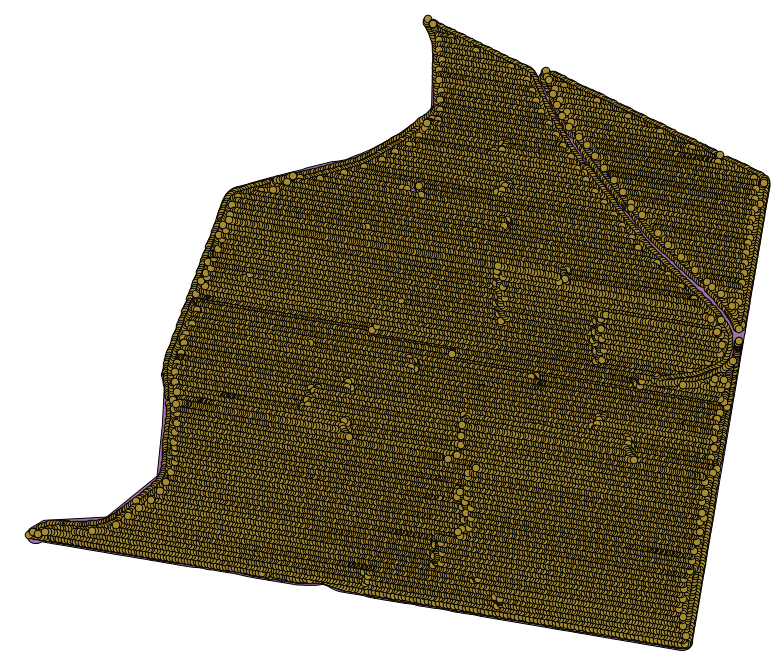

Interpolation
============================================================

.. note:: This chapter shows how to interpolate point data, and will show you another real example of performing spatial analysis

In this lesson, we are going to interpolate points data to obtain a raster layer. BEfore doing it, we will have to do some data preparation, and after interpolating we will add some extra processing to modify the resulting layer, so we will have a complete analysis routine.

Open the example data for this lesson, which should look like this.

The data correspond to crop yield data, as produced by a modern harvester, and we will use it to get a raster layer of crop yield.