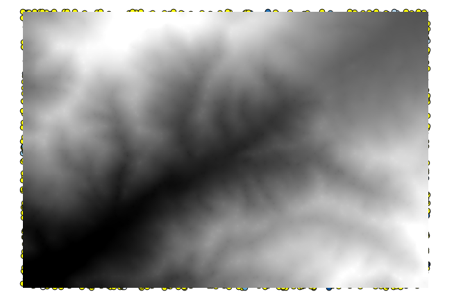
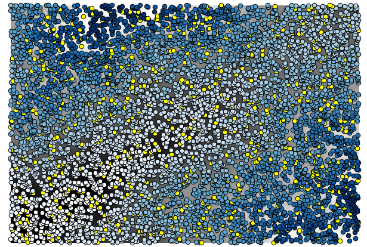
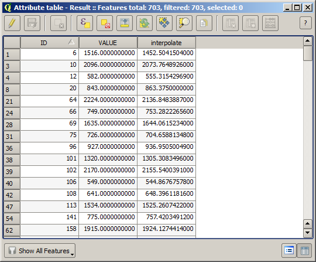

More interpolation 
===================

.. note:: This chapter shows another practical case where interpolation algorithms are used

The data for this lesson contains also a points layer, in this case with elevation data. We are going to interpolate it much in the same way as we did in the previous lesson, but this time we will save part of the original data to use it for asessing the quality of the interpolation process.

First, we have to rasterize the points layer and fill the resulting no-data cells, but using just a fraction of the points in the layer. We will save 10% of the points, so we need to have 90% of the points ready for the interpolation. To do so, we could use the *Split shapes layer randomly* algorithm, that we already know, but there is a better way to do that, without having to create any new intermediate layer. Instead of that, we can just select the points we want to use for the interpolation (the 90% fraction), and then run the algorithm. As we have already seen, the rasterizing algorithm will use only those selected points and ignore the rest. The selection can be done using the *xxxx* algorithm. Run it with the following parameters.

.. image:: img/interpolation_cross/select.png

That will select 90% of the points in the layer to rasterize

.. image:: img/interpolation_cross/selected.png

The selection is random, so your selection might differ fro the selection shown in the above image.

Now run the *Rasterized vector layer* to get the first raster layer

.. image:: img/interpolation_cross/rasterized.png

And then run the *Close gaps* algorithm to fill the no--data cells

To check the quality of the interpolation, we can now use the points that are not selected. At this points, we know the real elevation (the value in the points layer) and the interpolated elevation (the value in the interpolated raster layer). We can compare the by computing the differences between those values. 

Since we are going to use the points that are not selected, first, let's invert the selection.

The points contain the original values, but not the interpolate one. To add them in a new field, we can use the *xxxxx* algorithm

.. image:: img/interpolation_cross/xxxxxxxx.png

Now the layer contains both values

Now, we will use the fields calculator for this task. Open the *Field calculator* algorithm and run it with the following parameters.

.. image:: img/interpolation_cross/fields_calculator.png

You will get a new layer with just the points that we haven't used for the interpolation, each of them containing the difference between the two elevation values.

Representing that layer according to that value will give us a first idea of where the largest discrepancies are found.

.. image:: img/interpolation_cross/diffs.png

Interpolating that layer will get you a raster layer with the estimated error in all points of the interpolated area.

.. image:: img/interpolation_cross/raster_diffs.png

