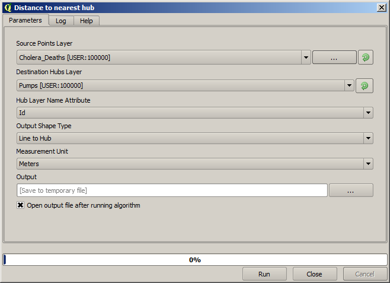
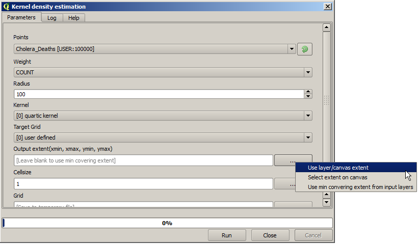

First analysis example
============================================================

.. note:: In this lesson we will perform some real analysis using just the toolbox, so you can get more familiar with the processing framework elements.

Now that everything is configured and we can use external algorithms, we have a very powerful tool to perform spatial analysis. It is time to work out a larger exercise with some real--world data. 

We will be using the well-known dataset that John Snow used in his groundbreaking work, and we will get some interesting results. The analysis of this dataset is pretty obvious and there is no need for sofisticated GIS techniques to end up with good results and conclusions, but it is a good way of showing how these spatial problems can be analyzed and solved by using different processing tools.

The dataset contains shapefiles with cholera deaths and pump locations, and an OSM rendered map in TIFF format. Open the corresponding QGIS project for this lesson.

.. image:: img/john_snow/project.png

The first thing to do is to calculting the Voronoi diagram (a.k.a. Thyessen polygons) of the pumps layer, to get the influence zone of each pump. The *Voronoi Diagram* algorithm can be used for that.

Pretty easy, but it will already give us interesting information.

Clearly, most cases are within one of the polygons

To get a more quantitative result, we can count the number of deaths in each polygon. Since each point represents a building where deaths occured, and the number of deaths is stored in an attribute, we cannot just count the points. We need a weighted count, so we will use the *Count points in polygon (weighted)* tool.

The new field will be called DEATHS, and we use the COUNT field as weighting field. The resulting table clearly reflects that the number of deaths in the polygon corresponding to the first pump is much larger than the other ones.

Another good way of visualizing the dependence of each point in the ``Cholera_deaths`` layer with a point in the ``Pumps`` layer is to draw a line to the closest one. This can be done with the *Distance to closest hub* tool, and using the configuration shown next.

The result looks like this:

Although the number of lines is larger in the case of the central pump, do not forget that this does not represent the number of deaths, but the number of locations where cholera cases were found. It is a representative parameter, but it is not considering that some locations might have more cases than other.

A density layer will also give us a very clear view of what is happening. We can create it with the *Kernel density* algorithm. Using the *Cholera_deaths* layer and its *COUNT* field as weight field, and with a radius of 100, we get something like this.

Combining with the pumps layer, we see that there is one pump clearly in the hotspot where the maximum density of death cases is found.

All these analysis are using euclidean distance, but people did not walk in straight lines to go to the pump to get some water. Let's try to take that into account.

There are many sources of spatial data where we could get vector roads data, but let's imagine that we cannot have other data apart from the OSM image. How could we use it?

First, let's classify the map, so as to have a new map with a given value (1 seems like a good one, we will later see why) in those pixels representing streets, and the no--data value in the rest of them. All non--street pixels correspond to buildings, and are rendered in a light-orange dark. This is a paletted image, and the index for that color is 204. To check it, you just have to select the information tool, select the image to query and click on any of those orange pixels. The dialog that shows up will tell you the band value.

So what we have to do is to change those pixels with a value of 204 to no-data (you cannot walk through buildings), and the rest of them to 1 (you can walk there). There are several ways of doing that. Using the *Reclassify* algorithm is one of them, but in this case we will use the *Raster calculator* algorithm instead.

Here is how the parameters dialog has to be filled.

You have to select the OSMMap layer in the *Grids* field. The formula ``ifelse(a=204, -99999,1)`` tells the algorithm that if the value in first grid in the *Grids* field (grids are referred as a, b, c,... or g1, g2, g3, etc, and in this case we just have one), the resulting value will be -99999 (no-data), otherwise it will be 1.

The resulting layer looks like this.

Roads are rendered in grey, buildings are transparent. Rename it to *streets*

You might notice that this is a quick and dirty classification, as it does not consider other colors in the map, like those of labels, but in the center area where the interesting stuff is happening, it represents a very good solution, so there is no need for more refinement.

Let's turn this layer into a new one where no--data vlaues will be preserved, but all street pixels, instead of having a value of 1, will have the walking distance to the closest pump, considering, of course, the streets.  This is going to be a raster analysis, so let's first convert the pumps vector layer into a raster one.

Select the *Rasterize vector layer* tool in and fill it as shown next.

Remember that, to get the output extent, you do not have to type it. Click on the button on the right-hand side and select *Use layer/canvas extent*.

Since we will be using this rasterized layer along with the streets one, select the streets layer and its extent will be automatically added to the text field. You must do the same with the cellsize, selecting the cellsize of the streets layer.

The resulting layer looks mostly transparent, as it is all comprised of no-data values, except for those pixels where a point representing a pump was found. You might not see them, but those pixels are there, do not worry. We will use them in the next step. Rename the layer to "pumps"

Select the  *Accumulated cost (isotropic)* algorithm and set the following values.

Execute the algorithm and you will get two new layers, one with the cost, and another with the index of the closest destination point (the closest pump). This last one is really more interesting for us. Changing the styling to use the *Pseudocolor* color map, and adding the vector *Pumps* and *Cholera_deaths* layers, you should get something like this.

There is not much difference when compared with the Voronoi polygons, but it it illustrates a different way of getting to the same result. Other parameters (i.e. steepness of streets) can be incorporated this way, just changing the cost layer (now cost is 1 through all cells).

If you want a little challenge, the ``cholera_deaths`` points layer can be extended sampling the closest point raster layer, adding a new attribute with the index of the closest pump. Try to find out how to do that.

