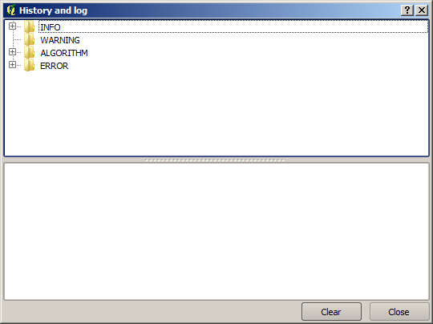

The SEXTANTE log
====================

.. note:: This lesson describes the SEXTANTE log

All the analysis performed with SEXTANTE is logged in its own logging system. This allows you to know more about what has been done with SEXTANTE, to solve problems when they happen, and also to re--run previous operations, since the logging system also implements some interactivity.

To open the log, select the corresponding entry in the SEXTANTE menu. You will see the following dialog.

It contains three blocks of information: *Info*, *Error* and *Algorithms*. Here is a description of all of them.

*Info

